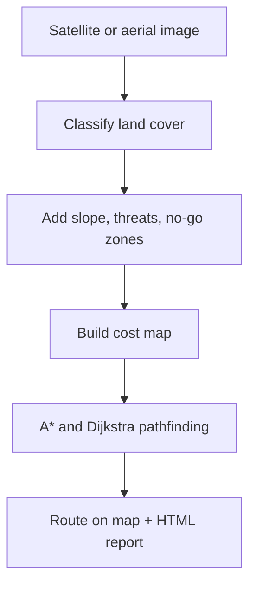

# Boots On Ground

[](https://www.python.org/)
[](https://streamlit.io/)
[](LICENSE)

**Author:** [Garv Arora](https://github.com/Garv-Arora2) · 2026

**Terrain intelligence and route planning from satellite imagery.** Boots On Ground turns aerial photos into a weighted mobility map: it classifies what the ground is made of, applies mission rules (vehicle type, slope, no-go areas, threat exposure), and computes optimal paths with A* and Dijkstra. It is built for off-road and low-map environments, not for turning pixels into a street-navigation clone.

## What is this?

Navigation apps assume a road network already exists. Boots On Ground assumes the opposite: you have fresh imagery and need to decide **where movement is possible, how hard it is, and which path best fits the mission**.

Typical inputs are disaster orthophotos, rural satellite tiles, or drone mosaics where maps are missing, outdated, or irrelevant. The system does not snap to highways. It reads the surface, builds a **traversability cost field**, and searches that grid under constraints you define.

**Pipeline**

1. **Land-cover classification** (`terrain.py`): each pixel becomes road, vegetation, water, building, or bare ground (NDVI/NDWI on multiband GeoTIFFs; tuned color rules on RGB).
2. **Layered cost model** (`planning.py`): separate factors stack into one movement-cost grid:
   - **Terrain cost (per agent):** a foot soldier can ford water slowly; a jeep cannot cross water or buildings; a tank handles vegetation differently than a convoy. Same image, different mobility profile.
   - **Slope (SRTM):** steep ground adds penalty or becomes impassable above an agent-specific limit.
   - **Avoid zones (hard):** operator-drawn no-go circles are blocked entirely.
   - **Threat zones (soft):** danger areas add cost that falls off with distance; a fast-vs-safe slider controls how strongly the route detours.
3. **Pathfinding** (`routing.py`): custom A* and Dijkstra on the final cost map, with grid downsampling for speed and full-resolution route display.
4. **Outputs:** route overlay on the interactive map, agent comparison, elevation/terrain breakdown, Folium view, and HTML report. Optional OSM fusion and two-date change detection.

The design keeps pathfinding fixed and expresses new mission logic as **cost layers**. That is the same pattern used in real mobility and GIS systems: one solver, many weighted constraints.

## How it works



**In short:** imagery becomes a classified surface, mission rules become weights on that surface, and graph search finds the least-cost path. Water, slope, and threats are not binary "avoid" decisions unless you mark them as no-go zones.

## Features

- Land cover from satellite pixels (color rules on RGB, proper indices on GeoTIFF).
- Four mover types with different rules (foot, jeep, convoy, tank).
- Draw no-go and threat zones on a zoomable map.
- A* and Dijkstra written from scratch, compared side by side.
- Optional: real Sentinel-2 / drone imagery, OpenStreetMap overlay, NASA elevation slope.
- Compare two images of the same place to spot new buildings or vegetation change.

## Project layout

```
Boots-On-Ground/
├── app.py                      # Start here (Streamlit UI)
├── boots_on_ground/            # Main code (Boots On Ground package)
│   ├── terrain.py              # Classify pixels
│   ├── planning.py             # Agents, zones, cost map
│   ├── routing.py              # A* and Dijkstra
│   ├── loader.py, elevation.py, osm.py, change.py, ...
│   └── ...
├── config/
│   └── satellite_scenes.py     # List of downloadable real scenes
├── scripts/
│   ├── download_satellite.py   # Pull real imagery into data/satellite/
│   └── generate_*.py           # Regenerate demo files
└── data/
    ├── assets/                 # Small demo images (in git)
    ├── synthetic/              # Auto-made demo scenes
    └── satellite/              # Downloaded GeoTIFFs
```

The folder is named `boots_on_ground` (underscores) because Python package names cannot contain spaces.

## Setup

```bash
git clone https://github.com/Garv-Arora2/Boots-On-Ground.git
cd Boots-On-Ground
python -m venv .venv

# Windows
.venv\Scripts\Activate.ps1

# Mac / Linux
source .venv/bin/activate

pip install -r requirements.txt
streamlit run app.py
```

Optional: download real satellite tiles (~10 MB, needs internet):

```bash
python scripts/download_satellite.py
```

## Using the app

1. Sidebar: load a **Synthetic demo** or **Real satellite** scene.
2. **Area Analysis** tab: zoom in, click to place **Start** and **End**.
3. Sidebar: click **Run pathfinder**. Green line = your route.
4. Other tabs: threats, change detection, agent comparison, Folium map, HTML download.

## Tech stack

Python · Streamlit · OpenCV · Rasterio · NumPy · Folium · srtm.py · Jinja2

Data: Sentinel-2, OpenAerialMap, OpenStreetMap, NASA SRTM.

## Limitations

- RGB-only images use simple color guessing; results depend on lighting.
- Pathfinding uses a smaller grid for speed, then scales the path back up.
- Elevation and OSM need a geo-tagged image and internet.

## License

Copyright (c) 2026 Garv Arora. All rights reserved. See [LICENSE](LICENSE).
